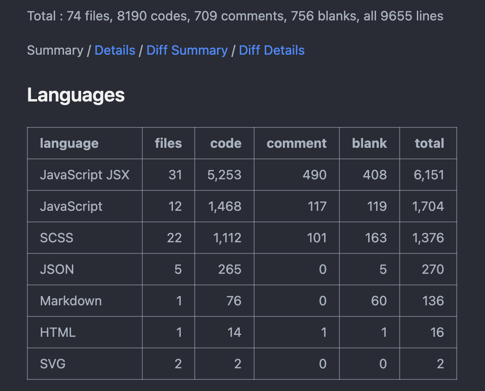

# Find-A-Service

The web application "Find a Service" aims to help customers in the UK find trustworthy service providers in their local area. The platform offers a wide range of services, including cleaning, babysitting, pest control, plumbing, electrical repairs, beauty, and other services.

Service providers can register on the platform and offer their respective services.

Platform administrators are responsible for reviewing service providers and managing platform data, which includes tasks such as removing inappropriate comments and deleting low-reputation providers.

Customers can use the map-based search feature on the platform to find services and place orders.

For a more detailed description of the functionalities, please refer to the "Functional Requirements" section.

> Find a Service 服务平台，帮助英国客户在他们所在地区找到值得信赖的服务提供商。该平台能够提供清洁、育儿、害虫控制、水暖维修、电器维修、美容或其他服务等多种服务。
>
> 服务提供商（Service Provider）在平台上注册并提供相应服务。
>
> 平台管理员（Admin）审核提供商并且管理平台数据（包括不限于删除违规评论、删除低信誉提供商等）。
>
> 客户（Customer）能在平台上通过地图进行搜索服务，选择服务下单。
>
> 更详细的功能介绍，请参见 <a href="#Functional Requirements(功能需求)">功能需求（Functional Requirements）</a> 部分


## 技术框架

+ 前端框架：React
+ UI 框架：AntD
+ 打包工具：Vite
+ 云数据库：Cloud Firebase（Non-SQL）
+ 后台服务器：Node.js + Express
+ 地图实现： Mapbox + Google Map
+ 语法规范工具：ESLint + Prettier




## Demo 视频

B站 Demo 视频 (Teams 答辩录屏)：[Porject Find-A-Service Demo_-_bilibili](https://www.bilibili.com/video/BV1Hp4y1V7gb/)

**Home Page**


**Service Detail Page**


## Functional Requirements(功能需求)

### Customer 

**Basic Features**

+ Req-cst-b1: Customers can create an account with an email address and password and indicate they are a customer. 客户可以使用电子邮件地址和密码创建账户，并标注自己是客户。

+ Req-cst-b2: Customers can search for a certain service in their local area, by providing the city name and category of the required service. 客户可以通过提供城市名称和所需服务的类别，在他们所在地区搜索特定的服务。

+ Req-cst-b3: Customers can see previous customers’ reviews and request a service according to the availability of the service, based on the available time and area. 客户可以查看之前客户的评论，并根据服务的可用时间和地区请求服务。

+ Req-cst-b4: The customers should be able to add a description of their requirements when they request a service. 客户在请求服务时应能够添加对其需求的描述。

+ Req-cst-b5: The customer can provide the demanded information or withdraw the requested service. 客户可以提供所需的信息或撤回请求的服务。

+ Req-cst-b6: A customer should be able to see a list of their requested services, including the request number, name, and status of the requested service. 客户应能够查看他们所请求服务的列表，包括请求编号、名称和服务的状态。

+ Req-cst-b7: When a service is completed, the status of the request should be updated accordingly, and a notification to add a review will be displayed to the customer. The system maintains a list of past services for each customer. 当服务完成后，请求的状态应相应更新，并向客户显示添加评论的通知。系统会为每个客户维护过去服务的列表。

**Advanced Features**

+ Req-cst-a1: Customers can signup/log in using their social media accounts, such as Google and Facebook. 客户可以使用他们的社交媒体账号，比如Google和Facebook，进行注册/登录。
+ Req-cst-a2: A customer can see the result of service providers’ search on a map and can set a radius for their search. 客户可以在地图上查看服务提供商搜索的结果，并可以设置搜索半径。


### Service Provider 

**Basic Features**

+ Req-srv-b1: Service providers can create an account by providing some description, an address, an email account, and a password. 服务提供商可以通过提供一些描述、地址、电子邮件账户和密码来创建账户。

+ Req-srv-b2: Service providers can add their services along with descriptions, photos, prices, areas they cover, and their availability, such as weekdays, 24/7 and so on. 服务提供商可以添加他们的服务，包括描述、照片、价格、覆盖的地区以及可用时间，比如工作日、24/7等。

+ Req-srv-b3: An approved service provider can receive a service request, review, accept, reject, or demand an update to the service request based on the customer’s description. 被批准的服务提供商可以收到服务请求，并根据客户的描述对服务请求进行审核、接受、拒绝或要求更新。

+ Req-srv-b4: Require an update on the request. 要求对请求进行更新。

**Advanced Features**

+ Req-srv-a1: When a service provider updates their services or has a new offer, the application should send notifications to users who have used the service in the past. 当服务提供商更新其服务或推出新的优惠时，应用程序应向之前使用过该服务的用户发送通知。


### Admin

 **Basic Features**

+ Req-adm-b1: Admin can give service providers permission to add their service.
  管理员可以授权服务提供商添加他们的服务。
+ Req-adm-b2: The admin can reject, request an update to the provided information or approve a request from a new service provider. Only when a service provider is approved, then they can advertise services to customers.
管理员可以拒绝、要求更新提供的信息或批准新服务提供商的请求。只有在服务提供商获得批准后，他们才能向客户宣传服务。

+ Req-adm-b3: An admin can remove a verified service provider if they receive multiple bad reviews.
管理员可以移除经过验证的服务提供商，如果他们收到多次差评。

+ Req-adm-b4: The system admin can delete reviews if found inappropriate.
系统管理员可以删除不适当的评论。

**Advanced Features**

+ Req-adm-a1: The system will send a verification email to the customers when signing up to verify their identity. 系统在客户注册时会发送验证电子邮件，以确认其身份。
+ Req-adm-a2: Deploy Web app to the Azure cloud platform. 将Web应用程序部署到Azure云平台。


## Notes

Before starting the project, please install the project dependencies:

```shell
yarn
# or use npm
npm install
```

The default git branch should be in `main` , if the main branch cannot start the webpage normally, please switch to `release/beta1` branch:

```shell
git checkout release/beta1
```

If you still encounter any problems after switching branches, it may be that the API Key of Firebase or Mapbox has expired, please replace it with a new API Key.

If you need any help, please do not hesitate to contact **`hs5n22@soton.ac.uk`**.